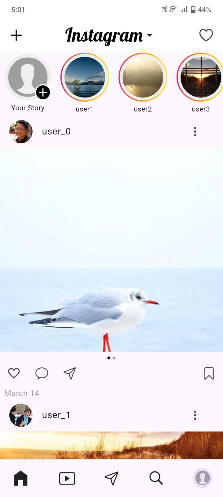

# 📱 Instagram Pixel-Perfect Feed (Flutter)

A Flutter implementation of the **Instagram Home Feed UI**, focusing on **pixel-perfect design, smooth scrolling, and clean architecture**.

This project replicates the core feed experience of the Instagram app including stories, posts, interactions, and infinite scrolling.

The UI is designed to closely match Instagram's layout while maintaining smooth performance and modular architecture.

Supports both **Android and iOS platforms**.

---

# 🚀 Features

* 📸 **Stories Bar** with gradient borders and "Your Story"
* 🖼 **Post Feed UI** similar to Instagram
* ❤️ **Like Toggle**
* 🔖 **Save / Bookmark Toggle**
* 💬 **Comments / Share Snackbar placeholders**
* 🖼 **Carousel Posts (multiple images)**
* 🔄 **Infinite Scroll Pagination**
* ⏳ **Shimmer Loading State**
* 🔍 **Smooth Scrolling Performance**
* 🧩 **Clean Architecture**

---

# 📸 Screenshot

<table>
<tr>
<td></td>
</tr>
</table>

### 🎥 Demo Video

[▶ Watch Demo](https://drive.google.com/file/d/1lITSwPWILgUGmmhnI5RDHLFjkl9WeoF2/view?usp=sharing)

---

# 🏗 Architecture

The project follows a **clean separation of concerns** to keep the code maintainable and scalable.

```
lib/
├── models/
├── providers/
├── repositories/
├── screens/
└── widgets/
```

### Folder Responsibilities

* **models** → Defines the data structures used in the app (Post, Story, etc.)
* **providers** → Contains Riverpod state management logic
* **repositories** → Handles data fetching (mock API layer)
* **widgets** → Reusable UI components like PostCard, StoryItem
* **screens** → Main UI screens of the application

This structure keeps **business logic separated from UI**, improving maintainability and scalability.

---

# 🧠 State Management

This project uses **Riverpod** for state management.

Riverpod was chosen because it:

* Provides **safe and predictable state management**
* Removes dependency on **BuildContext**
* Improves **testability and scalability**
* Keeps **business logic separate from UI**

In this project, Riverpod manages:

* Loading posts
* Infinite scrolling
* Post interaction states (like/save)

---

# 📡 Data Layer

The project uses a **mock repository (`PostRepository`)** to simulate a backend API.

Features:

* Returns **Future-based mock data**
* Simulates **network latency (~1.5 seconds)**
* Supports **pagination for infinite scrolling**

This approach demonstrates how the UI would interact with a real backend service.

---

# 📦 Packages Used

* **flutter_riverpod** – State management for handling reactive app state
* **cached_network_image** – Efficient network image loading with caching
* **shimmer** – Loading skeleton animation while data is being fetched
* **smooth_page_indicator** – Carousel indicator for multiple post images
* **google_fonts** – Instagram-style typography
* **cupertino_icons** – iOS-style icons used in the UI

These packages were used to improve **performance, maintainability, and user experience**.

---

# ▶️ How to Run the Project

### 1️⃣ Clone the repository

```
git clone https://github.com/rajgupta321/Instagram_clone.git
```

### 2️⃣ Navigate to the project directory

```
cd Instagram_clone
```

### 3️⃣ Install dependencies

```
flutter pub get
```

### 4️⃣ Run the application

```
flutter run
```

---

# 📦 Build APK

To generate a release APK, run the following command:

```
flutter build apk
```

After the build is complete, the APK file will be generated at:

```
build/app/outputs/flutter-apk/app-release.apk
```
---

# 📦 APK Download

You can directly install the Android APK from the project folder:

```
apk/app-release.apk
```

---

# 🎯 Evaluation Focus

This project focuses on:

* **Pixel-perfect UI replication**
* **Smooth scrolling performance**
* **Clean architecture and modular widgets**
* **State management best practices**
* **Handling loading states and pagination**

---

# 👨‍💻 Author

**Raj Gupta**

Flutter Developer
